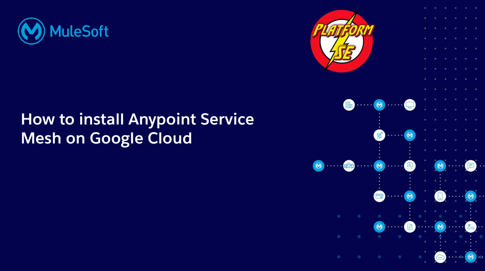  
Update: March 15, 2020

## Introduction

This cookbook will walk you through the process of installing **Anypoint Service Mesh** on **Google Cloud Platform**. You will deploy a demo application and secure using Anypoint Service Mesh.

***To log issues***, click here to go to the [github](https://github.com/mulesoft-consulting/ASMonGCP/issues) repository issue submission form.

## Objectives

- [Create Kubernetes cluster on Google Kubernetes Engine (GKE)](#installgke)
- [Install Istio](#installistio)
- [Deploy Demo Application](#deploydemo)
- [Install Anypoint Service Mesh](#installasm)
- [Apply API Management Policies](#applypolicy)

## Required Artifacts

- The following lab requires a Google Cloud Platform account.
- Enable Anypoint Service Mesh in your STGX Orginization

<a id="installgke"></a>
## Create Google Kubernetes cluster

### **STEP 1**: Create Google VPC

- From any browser, go to the URL to access Google Cloud Console:

   <https://console.cloud.google.com/>

- Click on the upper left navigation bar. Select **VPC networks**

    

- Click **Create a VPC network**

- Enter **name** for network and select **Automatic** for Subnet creation.

    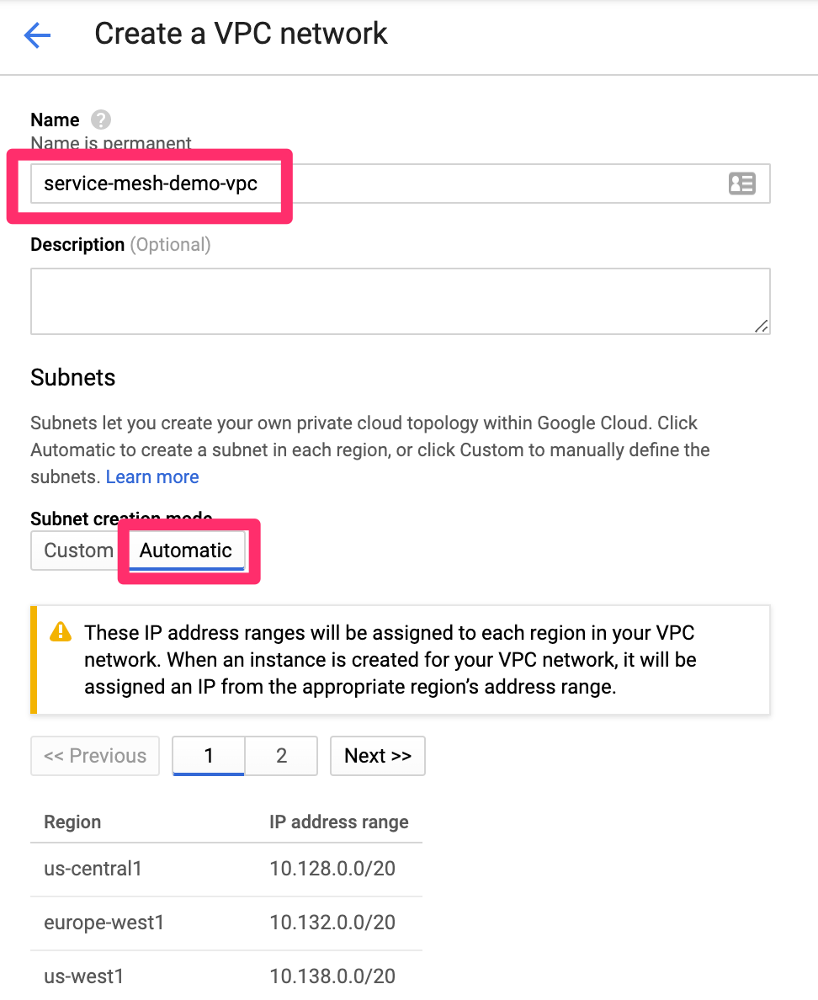

- Click **Create**. Wait for network to be created.

    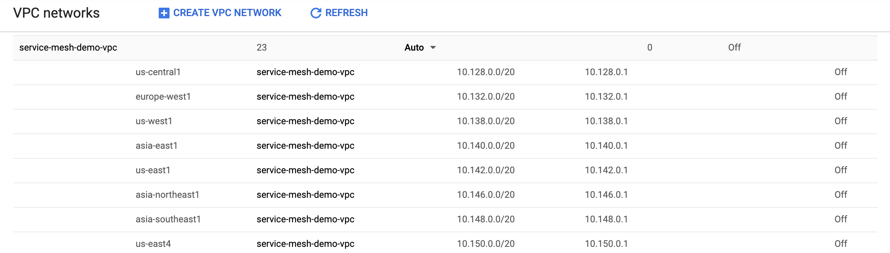

### **STEP 2**: Create Kubernetes Cluster

- Click on the upper left navigation bar. Select **Clusters**

    

- Click **Create cluster**

- Enter **Name** for your cluster

    

- Expand **default-pool** and select **Nodes**. Per [documentation](https://beta.docs.stgx.mulesoft.com/beta-service-mesh/service-mesh/1.0/prepare-to-install-service-mesh#hardware-requirements) change Machine type to **n1-standard-4**

    

- Click **Networking** and select your network created in previous step.

    

- Click **CREATE** and wait of cluster to be created.

    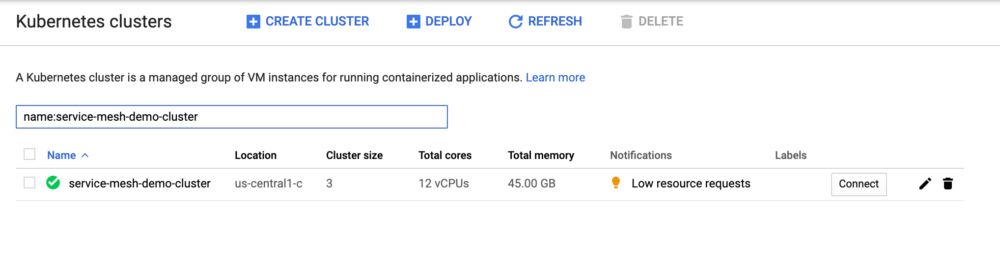

### **STEP 3**: Verify Cluster and Connect

- From the Kubernetes Cluster page click **Connect**. From the **Connect to the cluster** popup copy the **Command-line access** command.

    

- Open Terminal window. If you don't already have the **gcloud** cli installed following the [Gpoogle Docs](https://cloud.google.com/pubsub/docs/quickstart-cli) to first install gcloud cli.

- Paste gcloud **connect to cluster** command from previous step.

- Next running the following command to verify that you cluster is running.

```bash
kubectl get namespaces
```

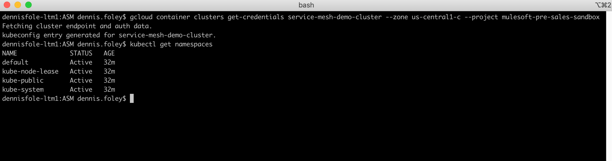

<a id="installistio"></a>
## Install Istio

### **STEP 4**: Download and Install Istio CLI

- To install **Istio** we will be using the **Istio CLI**. For completed instructions [Istio Docs](https://istio.io/docs/setup/install/istioctl/)

- Use the following command to download **Istio CLI** into your directory of choice. In this example I am using diretory **/Users/dennis.foley/ASM**

```bash
curl -L https://istio.io/downloadIstio | ISTIO_VERSION=1.4.3 sh -
```

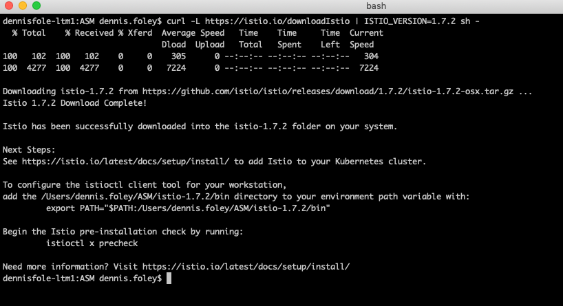

- Change into newly downloaded dirctory

```bash
cd istio-1.4.3/
```

- Add current directly to path

```bash
export PATH=$PWD/bin:$PATH
```


### **STEP 5**: Install Istio using CLI
- To install **Istio** we will be using the **Istio CLI**. From the **istio** directory run the following command

```bash
istioctl manifest apply --set profile=demo --set values.global.disablePolicyChecks=false,values.pilot.policy.enabled=true
```

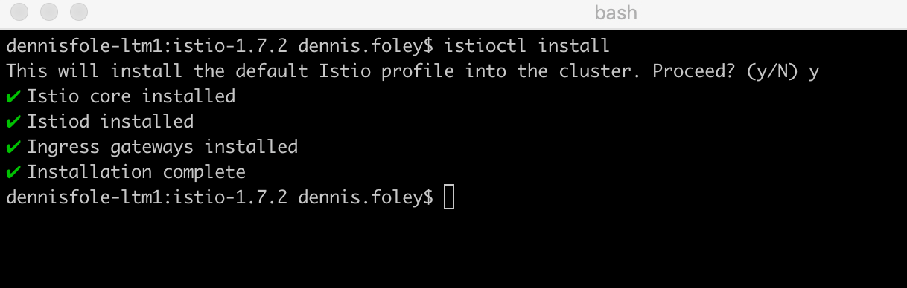

- Verify that **Istio** has been installed. You should now see the **istio-system** namespace

```bash
kubectl get namespaces
```

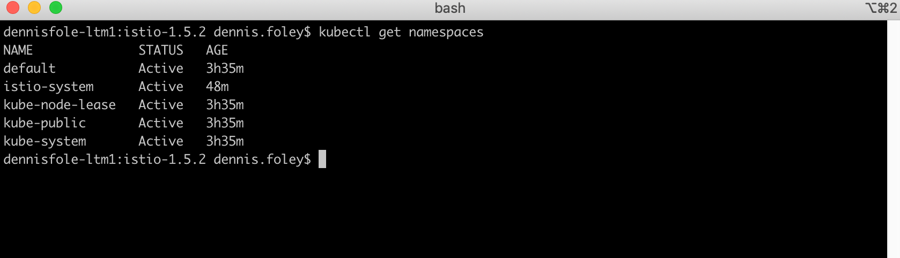

<a id="deploydemo"></a>
## Deploy Demo Application

### **STEP 6**: Clone Demo Application

- For our demo application will will be using **Northern Trail Outfitters** shopping cart application. This web based UI will call several services to complete the order.

- Clone the demo application git repository onto your local machine.

```bash
git clone https://github.com/mulesoft-consulting/ServiceMeshDemo
```

- Change to the **ServiceMeshDemo** directory and list out the contents to verify that the repository has been created correctly

```bash
cd ServiceMeshDemo/
ls
```


### **STEP 7**: Deploy Demo Application

- We will now deploy the demo application to your kubernetes cluster. The deployment script takes the namesapce as a parameter. We will be using **nto-payment** for namespace

```bash
./deployAll.sh nto-payment
```

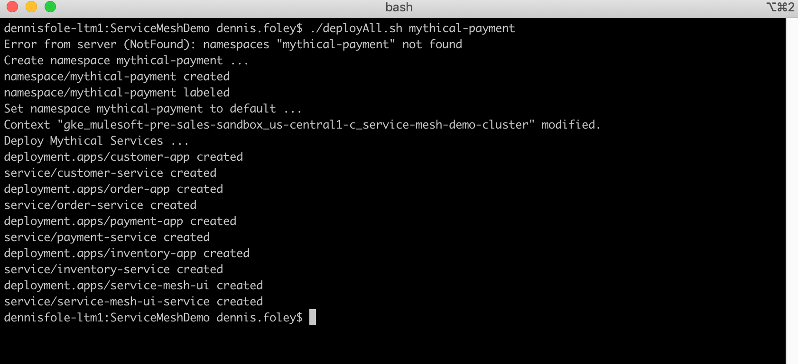

- You can monitory the deployment with the following commands

```bash
kubectl get pods -n nto-payment
kubectl get services -n nto-payment
```

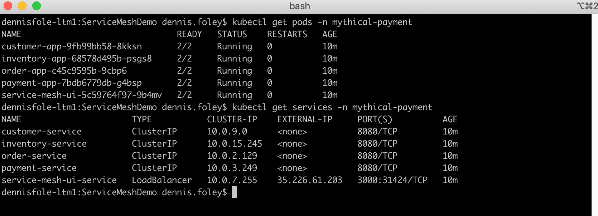

- Once all services are running you can test out the application. To access the applicastion open you browser and go to the following URL

```bash
http://<EXTERNAL-IP>:3000
```

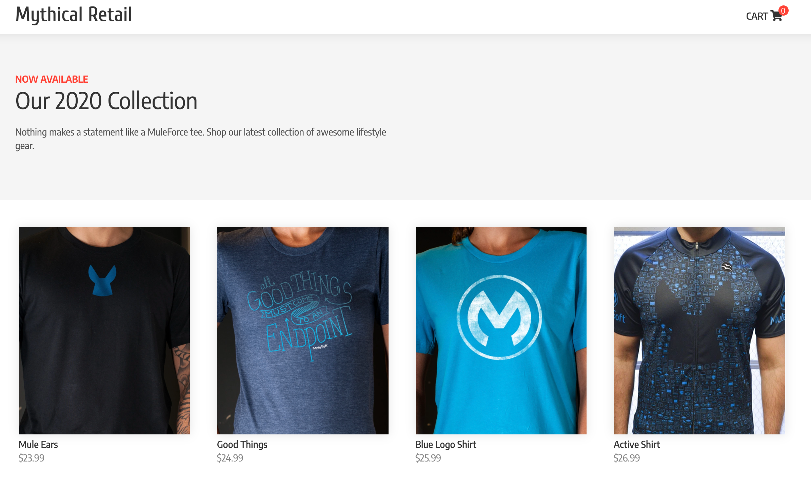

- To test out the application follow these steps:

    - Select Item to puchase
    - Click **Add to Cart**
    - Click **Checkout**
    - Leave default email and click **CONTINUE**
    - Click **AUTHORIZE PAYMENT**
    - Last click **PLACE ORDER**

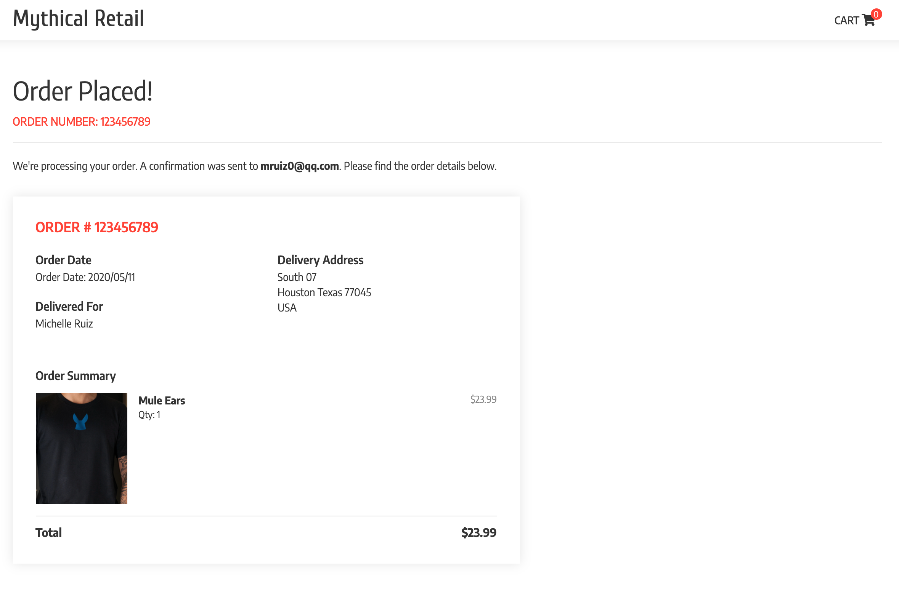

<a id="installasm"></a>
## Install Anypoint Service Mesh

### **STEP 8**: Install Anypoint Service Mesh

For complete instructions and documentation please visit [MuleSoft Docs](https://beta.docs.stgx.mulesoft.com/beta-service-mesh/service-mesh/1.0/service-mesh-overview-and-landing-page)

- First lets enable API Analytics by setting the **disableMixerHttpReports** flag to false:

```bash
kubectl -n istio-system get cm istio -o yaml | sed -e 's/disableMixerHttpReports: true/disableMixerHttpReports: false/g' | kubectl replace -f -
```


- Download the latest Anypoint Service Mesh CLI and make it executable

```bash
curl -Ls http://anypoint.mulesoft.com/servicemesh/xapi/v1/install > asmctl && chmod +x asmctl
```

- Since ASM is Pre-GA we will be using a staging environment. To have the **asmcli** connect to the correct environment set the variable **SERVICEMESH_PLATFORM_URI**

```bash
export SERVICEMESH_PLATFORM_URI=https://stgx.anypoint.mulesoft.com
```

- Now we are ready to install Anypoint Service Mesh. To do this we will call **asmcli install**. This command requires 3 parameters
    - Client Id
    - Client Secret
    - Service Mesh license

- If you are not familiar with how to get environment Client Id and Secret please visit [MuleSoft Docs](https://docs.mulesoft.com/access-management/environments)

```bash
./asmcli install
```

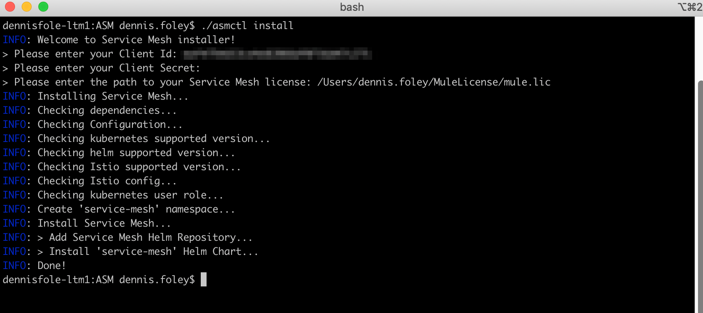

- Verify that Anypoint Service Mesh has been installed correctly with the following command

```bash
kubectl get pods -n service-mesh
```

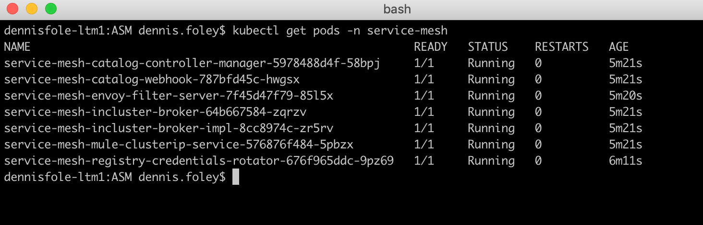

### **STEP 9**: Install Anypoint Service Mesh Adapter

- Next we want to deploy the Anypoint Service Mesh adapter in each namespace that we want to monitor API's. For this example we will just be doing the **nto-payment** namespace that contains the demo application.

- To deply the ASM Adapter we will be using a Kubernetes custom resource definition (CRD). In the ServiceMeshDemo repostory we have create the file **nto-payment-asm-adapter.yaml** that can mofidied.

    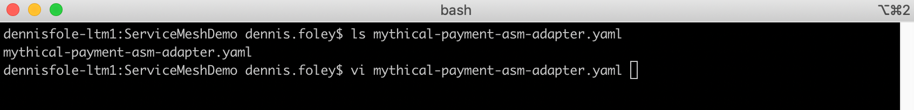

- Replace **```<CLIENT ID>```** and **```<CLIENT SECRET>```** with values for your environment. Save file and run the following command

```bash
kubectl apply -f nto-payment-asm-adapter.yaml
```

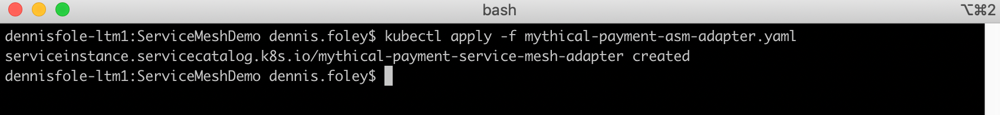

- Use the following command to monitor the progress. Wait for status to change to **Ready**

```bash
asmctl adapter list
```

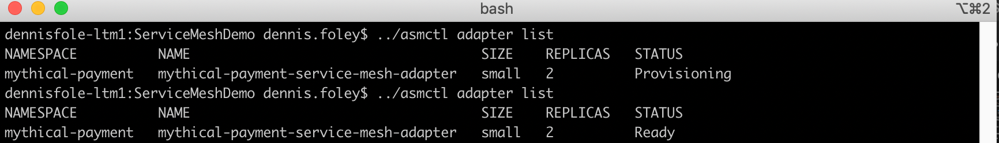

### **STEP 10**: Create APi's

- We will now use now use Anypoint Service Mesh autodiscovery to create API's in Anypoint Platform. We will create API's for Customer, Inventory, Order and Payments services that are used by the demo application.

- Modify the Kubernetes custom resource definition (CRD) file **demo-apis.yaml**. 

- For each API, replace **```<ENV ID>```**, **```<USER>```** and **```<PASSWORD>```** with the values for your environment. If you are unsure how to get the environment Id check out this [article](https://help.mulesoft.com/s/question/0D52T00004mXPvSSAW/how-to-find-cloud-hub-environment-id). Save the file and run the following command

***NOTE: *** If you run this multiple times you might need to change the version number since Anypoint Platform will keep it around for 7 days.

```bash
kubectl apply -f demo-apis.yaml
```


- Use the following command to monitor the progress. Wait for status to change to **Ready**

```bash
asmctl api list
```

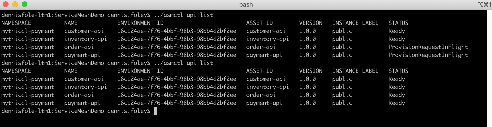

- You can also verify that the API's have been created in Anypoint Platform. Go to Anypoint Platform and navigate to **API Manager**

    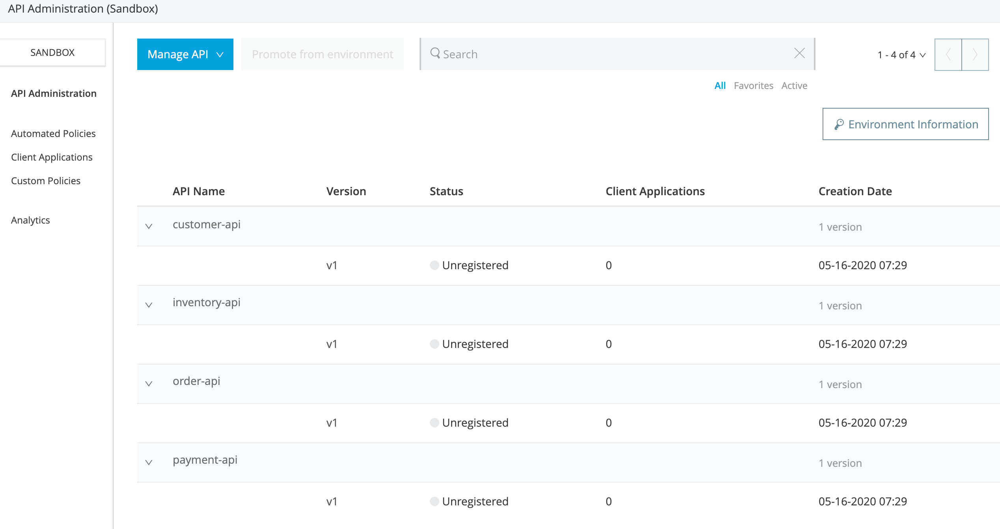

### **STEP 11**: Binding API's with Services

- The last step is to bind the Kubernetes Services with the Anypoint Platform API's. To do this you will use the binding definition file **demo-bind-apis.yaml**. Execute the following command

```bash
kubectl apply -f demo-bind-apis.yaml
```


- Use the following command to monitor the progress. Wait for status to change to **Ready**

```bash
asmctl api binding list
```

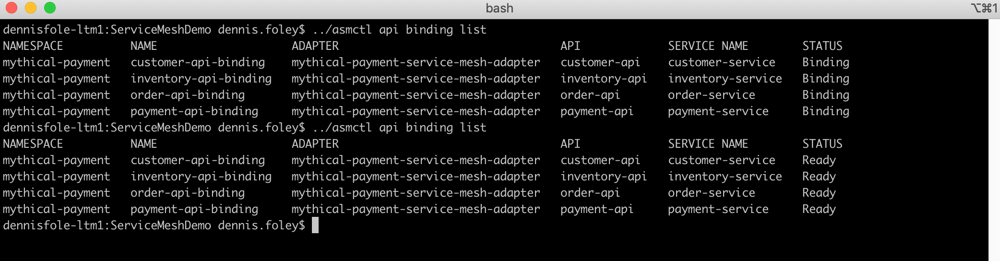

- If you go may to **API Management** in Anypoint Platform and refresh the page you will see that the API's are now **Active**. 

- You have complted the installation of Anypoint Service Mesh. In the next secion we will walk through appling some policies against the kubernetes services.

<a id="applypolicy"></a>
## Apply API Management Policies

### **STEP 12**: Apply Rate Limiting Policy to Customer API

- From the **API Management** Screen in Anypoint Platform click on the version number for **customer-api**

    

- Click **Policies** and then click **Apply New Policy**. Expand **Rate Limiting** select newest version and click **Configure Polcy**. 

    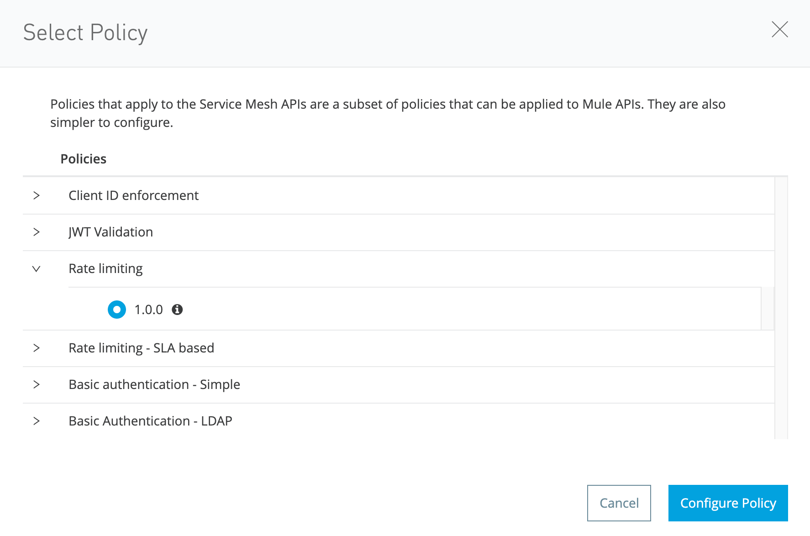

- We will configure the rate limit to be 1 call per minute. Click **Apply**

    

- You should now see your new **Rate limiting** policy. To test this out run through the order process in the demo application. Try to run through it 2 times within a minute. The second time through you will get **Account Retrieval Failed** error.

    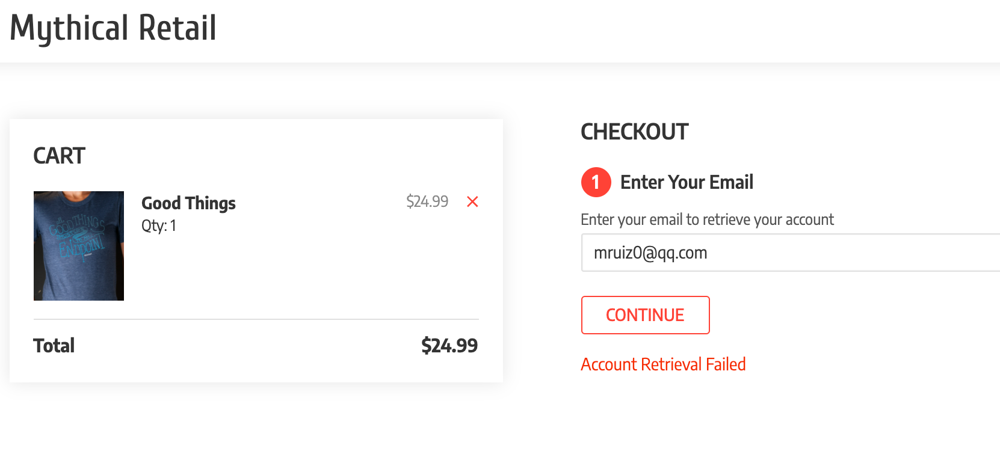

- Before moving onto the next step remove the **Rate Limiting** policy.

### **STEP 13**: Apply Client ID enforcement Policy to Payment API

- Navigate back to the ***API Administration** page. Click on the version number for **payment-api**.

- Click **Policies** and then click **Apply New Policy**. Expand **Client ID enforcement** select newest version and click **Configure Polcy**. 

    

- Leave all defaults and click **APPLY**

- You should now see your new **Client ID enforcement** policy. Once again run through the demo application but this time you should see **Payment Authorization Failed** when you click **AUTHORIZE PAYMENT**

    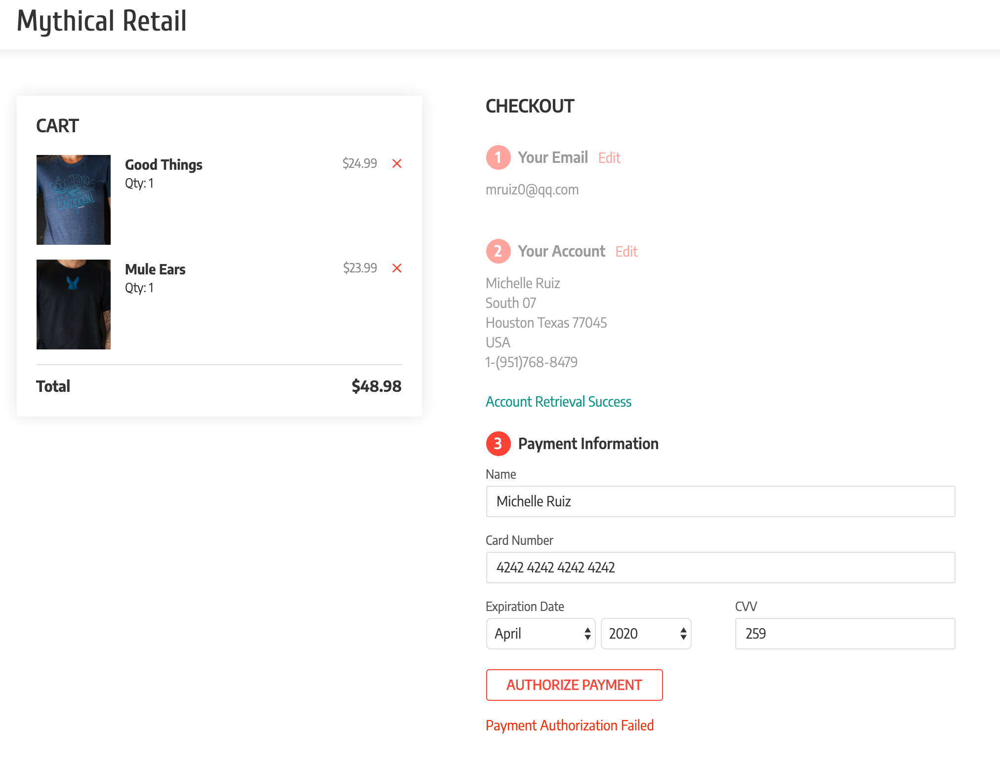

**CONGRATULATIONS!!!** You have completed install Anypoint Service Mesh and applying policies to kubernetes services via Anypoint Platform.


